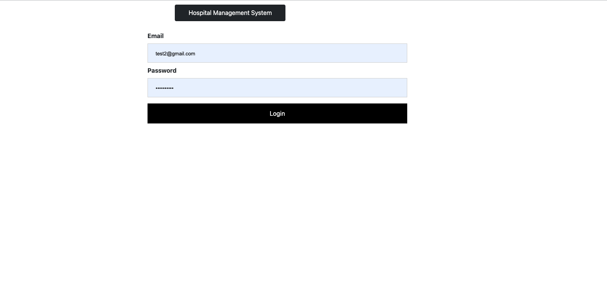
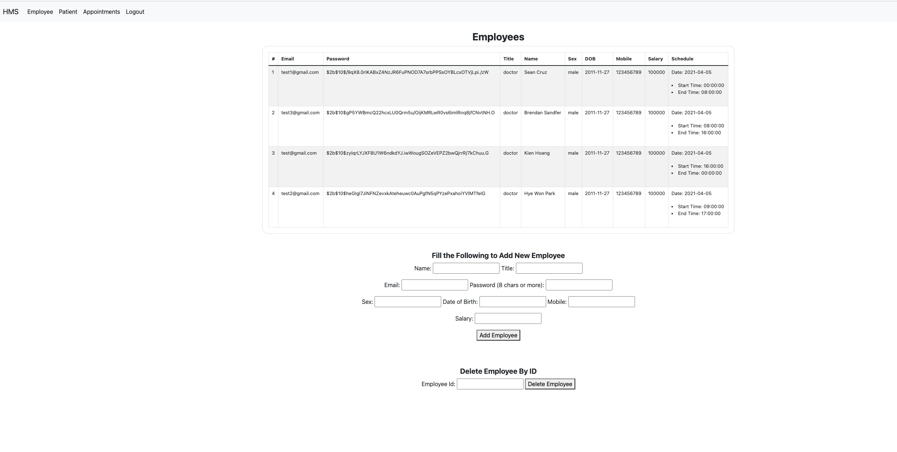
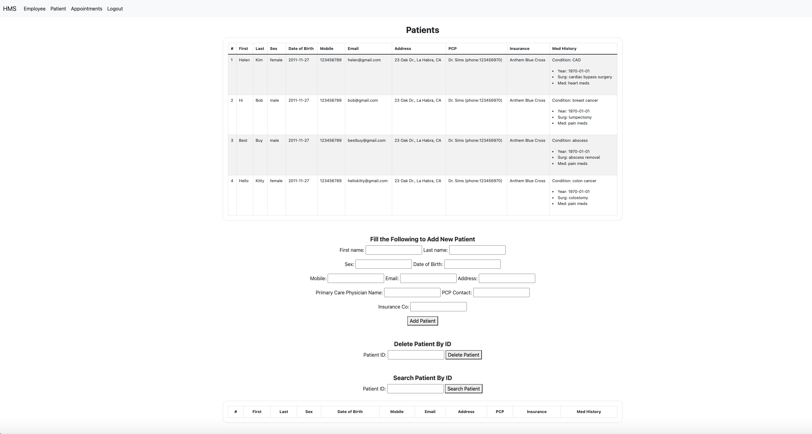
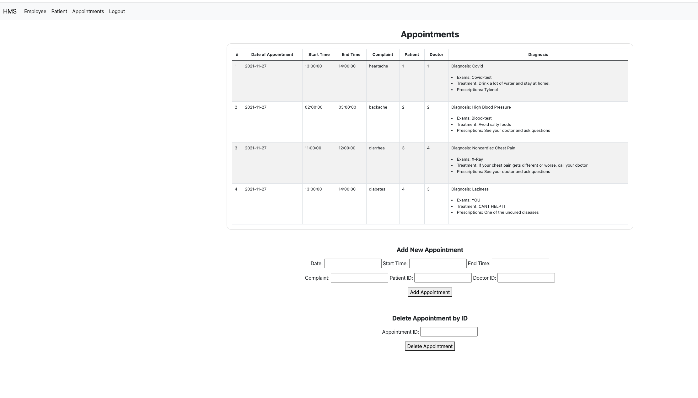

# 
  
# Hospital Management System 

## Description

What’s arguably the most important thing we focus on in our lives? It’s our health. There is no room for error when managing our health and our health providers need a simple, yet effective system to manage patients' health records and appointments all in one place. Our HMS is a computer system that helps manage the information related to health care and aids in the job completion of health care providers effectively. Admins/staff/doctors of small health clinics can use this application to easily access information about all employees, patients, and their appointments, as well as update/delete info.

## Table of Contents
* [Installation](#installation)
* [Usage](#usage)
* [Contributing](#contributing)
* [Tests](#tests)
* [Questions](#questions)

## Installation

To install necessary dependencies, run the following commands: 

```
npm i, npm i express, npm i mysql2 sequelize, npm i dotenv, npm i bcrypt
```

## Usage

Users can access the application by clicking on this deployed app link: https://hw--hsm.herokuapp.com/. General login info is the following: email: test@gmail.com, pw: testing123

## License

This project is licensed under the terms of the APACHE_2.0.

## Contributing

Simply clone down if you would like to contribute and add improvements, and install the necessary packages as described above.

## Tests

To run tests, run the following command:

```
node server.js, node seeds/index.js (to access seeds)
```

## Questions

If you have any questions about the repo, contact me directly at bsandfer@gmail.com, hyewonpark26@gmail.com, kien.dv2012@gmail.com, seankennethcruz@gmail.com.
You can find more of my other projects at [bsandfer, hyep2, NGGKI, skcruzer]. (https://github.com/bsandfer, https://github.com/hyep2, https://github.com/NGGKI, https://github.com/skcruzer/).

## Display of Project
Log in Page:


Employees Portal:


Patients Portal:


Appointments Portal: 

